# Отчёт

__ФИО/группа:__ Ермолаева Елена Александровна БПИ224

__Вариант:__ 30

__Условие__
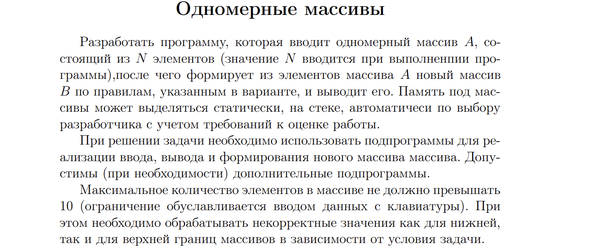

__Тесты и результаты__

1. n = 4; A = [3, 4, 5, 6]. Ожидаемый B = [4, 5, 6]

2. n = 4; A = [6, 5, 4, 3]. Ожидаемый B = []

3. A = [10, 11, 1, 3, 2]. Ожидаемый B = [11, 3]

4. n = 0. Ожидаемый вывод: уведомление о некорректности ввода

5. n = -1 (n < 0). Ожидаемый вывод: уведомление о некорректности ввода

6. n = 11 (n > 10). Ожидаемый вывод: уведомление о некорректности ввода

7. n = 3 A = [2, 2, 2]. Ожидаемый B = {}

8. n = 1 A = [ 2 ]. Ожидаемый B = {}

1.  
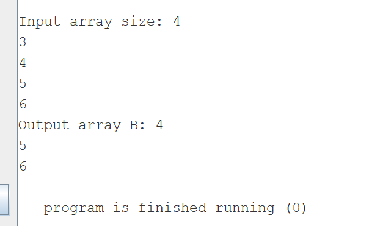
 
2. 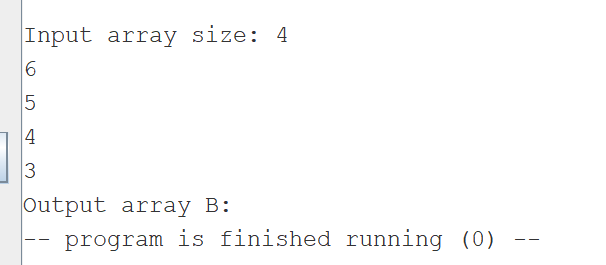

3. 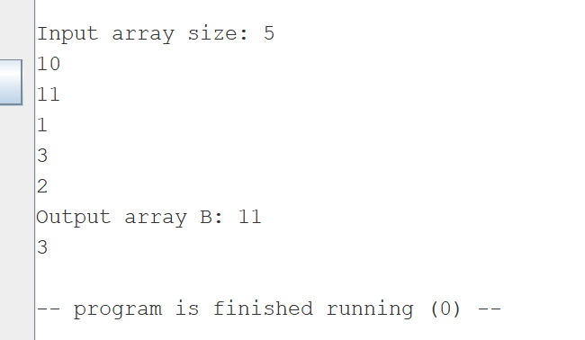

4.  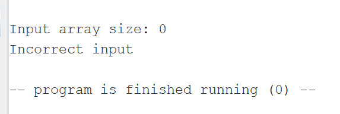

5. 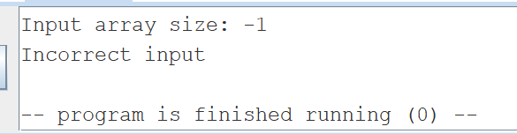

6.  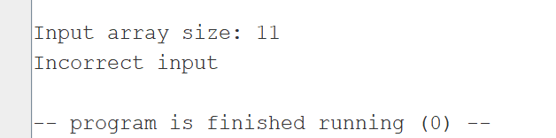

7. 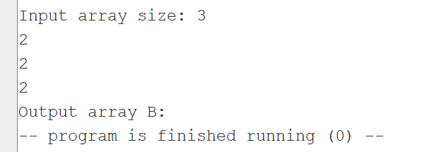

8. 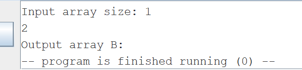

### Результат работы автоматического тестирования из файла test.asm:

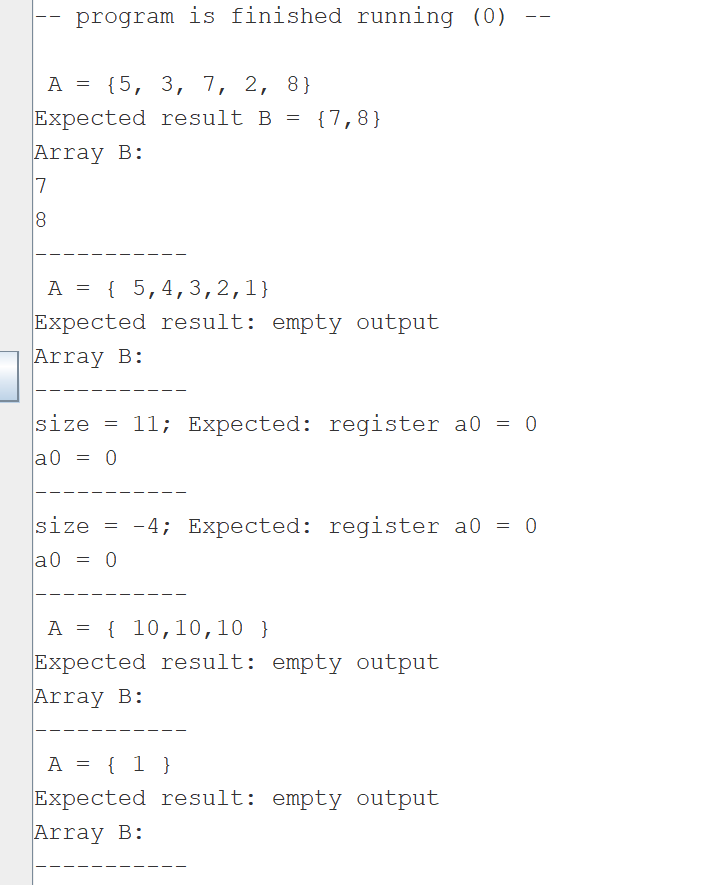

### Дополнительно:

Некоторые параметры передаются через стек, например в подпрограмме `check_size`. Однако, согласно конвенции принебольшом количестве параметров, они должны передаваться через регистры. Потому, исходя из дискуссий в чате курса :) лектором было разрешено передавать их через 
регистры (то есть критерий оценки 6-7)

В программе описаны в местах вызова функции комментарии, описывающие
передачу фактических параметров и перенос возвращаемого результата. (оценка 6-7)

Созданные подпрограммы обернуты в соответсвующие макросы (`input_array_(%array_size, %array_adress); output_array_(%array_size, %array_adress); convert_array_(%array_size, %array_adress_A, %array_adress_B); check_size_(%size) `)

Подгрограммы написаны в отдельных файлах, для обеспечения независимого использования в других программах (крит на оценку 8).

Автоматизированное тестирование выполено в файле test.asm, соответсвующий критерию 8 (воизбежание ошибок не рекомендуется хранить его в одной папке с main при запуске)

Подпрограммы output и input_array используют соотвествующие макросы для ввода элементов массива (`add_element` и `print_int`, а так же `read_int_a0` - для считывания числа в регистр a0 и `print_str(%x)`  для вывода строк в консоль). Так как макросы имеют параметры, то они способеы использоваться в других программах удовлетворяя критери оценки 9

Так же во избежание ошибок в системе рекомендуется установить слудующие настройки эмулятора и запускать только main.s и test.s, которые в свою очередь будут использовать ранее написанные подпрограммы через макросы.
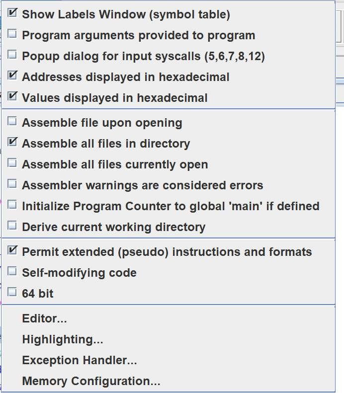

